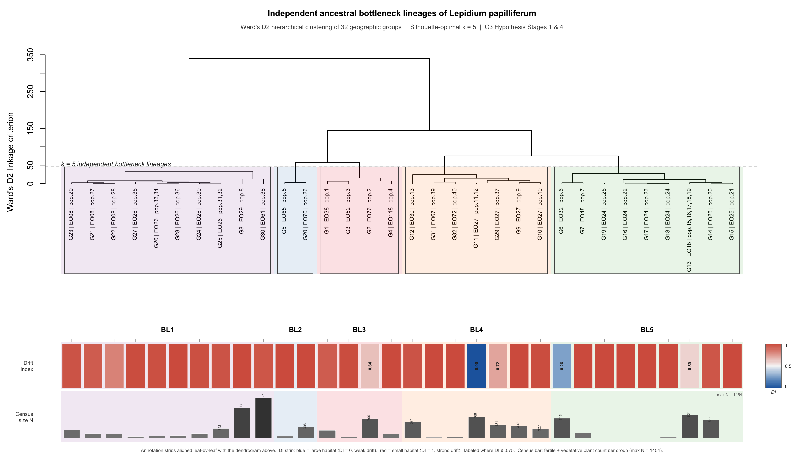
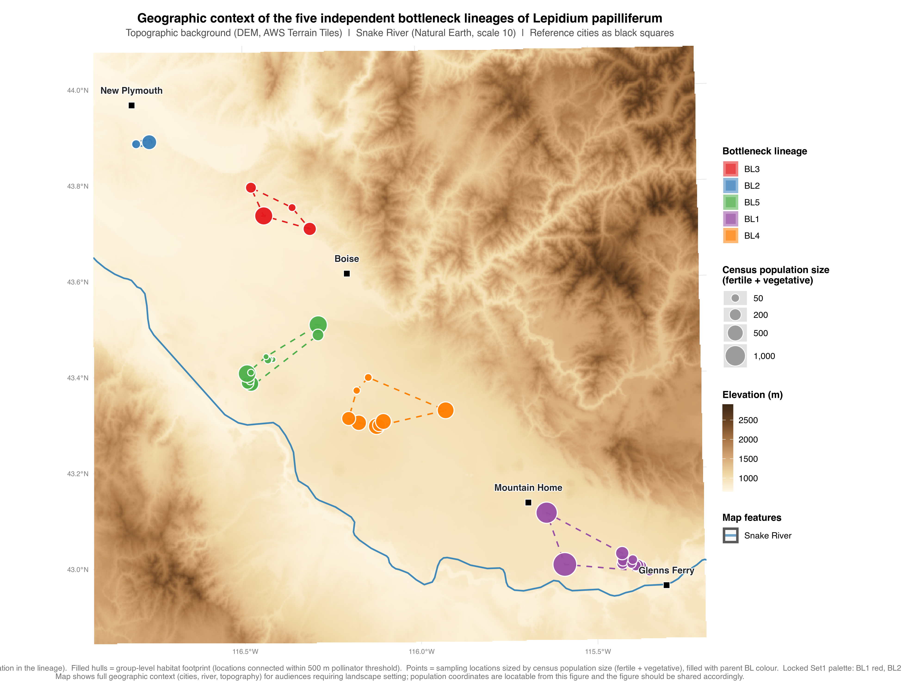
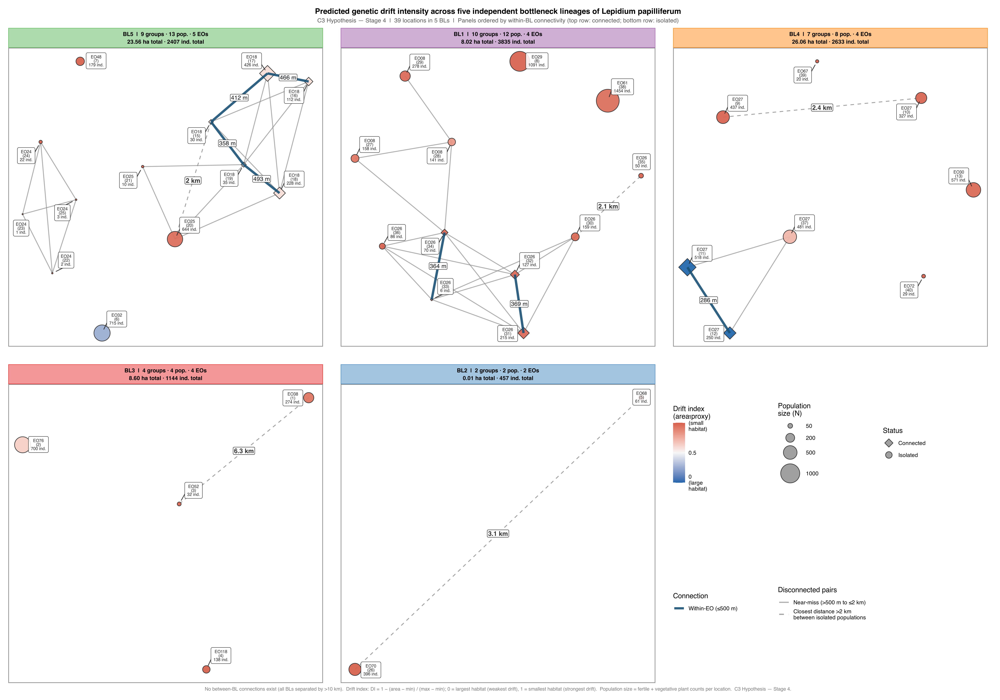

# LEPA EO Spatial Connectivity and Clustering

| | |
|---|---|
| **Author** | Sven Buerki (svenbuerki@boisestate.edu), Boise State University |
| **Script** | `EO_spatial_clustering.R` |
| **Project** | Quantifying the effect of habitat fragmentation on *Lepidium papilliferum* populations and estimating the number of independent demographic bottlenecks across the species range |
| **Related repository** | [SRK_bioinformatics / Canu_amplicon](https://github.com/svenbuerki/SRK_bioinformatics) — S-allele genotyping and bioinformatics pipeline; geographic groups and bottleneck lineages defined here serve as the sampling and interpretation framework for SRK analyses in that repo |

---

## Purpose

This repository provides a bioinformatics pipeline to quantify the effect of habitat fragmentation on *Lepidium papilliferum* (slickspot peppergrass, Brassicaceae) populations and to test hypotheses about the number of independent demographic bottlenecks across the species range. *Lepidium papilliferum* is a federally threatened mustard endemic to isolated slickspot microhabitats on the Snake River Plain, Idaho, and is the study system for an ongoing investigation of how fragmentation affects the self-incompatibility (SI) mating system and S-allele diversity.

Habitat fragmentation limits pollen-mediated gene flow between populations, causing each isolated unit to evolve independently under genetic drift. Identifying which locations share — and which have never shared — a pollinator pool is a prerequisite for interpreting S-allele diversity patterns from the related SRK bioinformatics pipeline and for determining how many independent bottleneck events have shaped the species' genetic landscape.

The pipeline answers two questions:

1. **Which locations share a pollinator pool today?** (500 m hull-to-hull threshold → geographic groups)
2. **Which groups were fragmented from the same ancestral metapopulation and now represent independent bottleneck units?** (Ward's D2 clustering → independent bottleneck lineages, BL1–BL5)

---

## Repository structure

```
LEPA_EO_spatial_clustering/
├── EO_spatial_clustering.R          # Main analysis script (canonical version)
├── README.md                        # This file
├── .gitignore
├── data/
│   ├── EO_connectivity_summary.csv  # Overall connectivity metrics
│   ├── EO_pairwise_connectivity.csv # All 741 location pairs with distances and link type
│   ├── EO_group_distances.csv       # Pairwise minimum distances between 32 groups
│   ├── EO_group_areas.csv           # Group union area (m², ha) and drift index
│   ├── EO_BL_summary.csv            # BL-level aggregated statistics
│   └── EO_group_BL_summary.csv      # Group-to-BL key with population IDs (cross-reference for SRK analyses)
└── figures/
    ├── EO_clustering_dendrogram.png      # Ward's D2 dendrogram with BL shading + DI strip
    ├── EO_BL_geographic_context_map.png  # Single-panel overview, all 5 BLs, with topo background + Snake River + reference cities
    └── EO_BL_drift_panel.png             # Five-panel BL network figures with drift index
```

> **Raw input data are not included in this repository.** The script requires the following input file, which contains decimal latitude/longitude coordinates for germplasm collection events and is maintained locally due to data sensitivity:
>
> - `Peggy_EOs_Germplasm_w_lat_long_from_Events_30Apr2026.csv`
>
> The derived outputs in `data/` contain no geographic coordinates and are safe for public sharing.

---

## Analytical pipeline

### Scientific rationale

*Lepidium papilliferum* occupies isolated slickspot microhabitats on the Snake River Plain. Its primary pollinators — small native bees and flies — are documented to disperse a maximum of approximately 500 m between patches. This threshold defines the boundary between connected and isolated demographic units: two locations within 500 m share a pollinator pool and can exchange genes through contemporary pollen flow; locations separated by more than 500 m are genetically and demographically isolated and therefore represent independent drift trajectories.

The analysis proceeds in two sequential steps.

### Step 1 — Geographic groups (500 m connectivity threshold)

All germplasm collection events within each `locationID` are pooled into a convex hull polygon (using UTM Zone 11N, EPSG:32611 for metre-accurate distances). Pairwise hull-to-hull distances are computed for all 39 × 39 location pairs. Locations within 500 m are treated as sharing a pollinator pool; connected components of the resulting graph define **geographic groups**.

Near-miss pairs (500 m–2 km apart) are flagged separately as potential management targets for connectivity restoration.

### Step 2 — Bottleneck lineages (Ward's D2 clustering)

Group centroids are used to compute pairwise distances between all 32 groups. Ward's D2 hierarchical clustering is applied to these centroid distances; the optimal number of clusters k is selected by silhouette score maximisation (k = 2–6). Each cluster is an **independent bottleneck lineage (BL)**: a set of groups close enough in space to have plausibly been part of the same ancestral metapopulation before habitat fragmentation severed connectivity between them. The number of BLs (k = 5, silhouette = 0.73) is the estimated number of independent bottleneck units produced by fragmentation across the species range, and defines the minimum number of geographic regions that must be sampled to capture landscape-wide genetic diversity.

### Drift index

For each geographic group, the union area of all member location hulls is computed (m², ha). A relative **drift index (DI)** is scaled linearly from 0 (largest group, weakest expected drift) to 1 (smallest group, strongest expected drift):

> DI = 1 − (area − min\_area) / (max\_area − min\_area)

DI is a spatial prioritisation tool, not a drift rate or Ne estimate. Eight groups with zero measured area (coordinate rounding artefact) are assigned DI = 1. See the Caveats section for limitations.

---

## Dependencies

R packages required:

```r
library(sf)          # spatial operations, hull polygons, distances
library(igraph)      # connected-component graph analysis
library(ggplot2)     # figures
library(ggrepel)     # label repulsion in network plots
library(RColorBrewer)
library(scales)
library(maps)
library(cluster)     # silhouette score
library(ggnewscale)  # dual fill scales
```

Install missing packages with `install.packages(c("sf", "igraph", "ggplot2", "ggrepel", "RColorBrewer", "scales", "maps", "cluster", "ggnewscale"))`.

---

## Running the script

1. Obtain the input file `Peggy_EOs_Germplasm_w_lat_long_from_Events_30Apr2026.csv` (not distributed in this repository — contact the author) and place it in the same directory as the script, or update `out_dir` at line 23–29 to point to its location.
2. Open `EO_spatial_clustering.R` in RStudio and run it, or source it from the command line: `Rscript EO_spatial_clustering.R`.
3. All output CSVs and figures are written to `out_dir`.

> The script uses `rstudioapi::getActiveDocumentContext()$path` to auto-detect `out_dir` when run interactively in RStudio. When sourced from the command line, it falls back to the hardcoded path at line 28 — update this path if needed.

---

## Results

### Overall connectivity

| Metric | Value |
|--------|-------|
| Locations analysed | 39 |
| EOs represented | 19 |
| Total location pairs evaluated | 741 |
| Connected pairs (≤500 m) | 7 |
| Within-EO connections | 7 |
| Between-EO connections | 0 |
| Isolated locations (no neighbour within 500 m) | 28 |
| Geographic groups (connected components) | 32 |
| Groups with >1 location | 4 |
| Closest unconnected group pair (m) | 586.3 |
| Farthest connected pair (m) | 493.4 |
| Independent bottleneck lineages (Ward's D2, k = 5) | 5 (silhouette = 0.73) |

The dominant finding is **extreme spatial isolation**: 28 of 39 locations (72%) have no neighbour within the 500 m pollinator dispersal limit, and all seven connected pairs are within the same EO — there are no between-EO connections. Every EO is genetically and demographically isolated from every other EO at the contemporary scale.

### Connected pairs

| Location A | EO | Location B | EO | Distance (m) | Link type |
|------------|-----|------------|-----|-------------|-----------|
| 11 | EO27 | 12 | EO27 | 285.6 | within-EO |
| 15 | EO18 | 19 | EO18 | 358.0 | within-EO |
| 33 | EO26 | 34 | EO26 | 364.1 | within-EO |
| 31 | EO26 | 32 | EO26 | 369.3 | within-EO |
| 15 | EO18 | 17 | EO18 | 412.2 | within-EO |
| 16 | EO18 | 17 | EO18 | 466.1 | within-EO |
| 18 | EO18 | 19 | EO18 | 493.4 | within-EO |

### Near-miss pairs (500 m–2 km)

These group pairs are isolated under current conditions but are candidates for connectivity restoration through targeted habitat management.

| Group A | Group B | EO(s) | Min distance (m) |
|---------|---------|-------|-----------------|
| 25 (EO26) | 26 (EO26) | EO26 | 586.3 |
| 21 (EO08) | 22 (EO08) | EO08 | 589.6 |
| 17 (EO24) | 18 (EO24) | EO24 | 628.5 |
| 16 (EO24) | 17 (EO24) | EO24 | 681.6 |
| 24 (EO26) | 25 (EO26) | EO26 | 731.1 |

### Multi-location geographic groups

Four of 32 groups contain more than one location:

| Group | EO | Locations (locationID) | N locations | Notes |
|-------|-----|------------------------|-------------|-------|
| 11 | EO27 | 11, 12 | 2 | 285.6 m apart |
| 13 | EO18 | 15, 16, 17, 18, 19 | 5 | Fully connected cluster; pairwise distances 358–493 m |
| 25 | EO26 | 31, 32 | 2 | 369.3 m apart |
| 26 | EO26 | 33, 34 | 2 | 364.1 m apart |

EO18 (group 13) is the largest connected cluster: all five of its populations form a single connected component and constitute the only location in the dataset with potential for ongoing internal gene flow.

### Group areas and drift index

Group union areas span four orders of magnitude (0 m² to ~19.6 ha). The full ranking from weakest to strongest predicted drift:

| Group | EO | N pop. | Area (ha) | Drift index |
|-------|----|--------|-----------|-------------|
| 11 | EO27 | 2 | 19.63 | 0.000 |
| 6 | EO32 | 1 | 14.62 | 0.255 |
| 2 | EO76 | 1 | 7.11 | 0.638 |
| 13 | EO18 | 5 | 8.08 | 0.588 |
| 29 | EO27 | 1 | 5.57 | 0.716 |
| 22 | EO08 | 1 | 3.44 | 0.825 |
| 21 | EO08 | 1 | 1.27 | 0.935 |
| 1 | EO38 | 1 | 1.23 | 0.938 |
| 30 | EO61 | 1 | 0.89 | 0.955 |
| 14 | EO25 | 1 | 0.81 | 0.959 |
| 23 | EO08 | 1 | 0.61 | 0.969 |
| 12 | EO30 | 1 | 0.53 | 0.973 |
| 24 | EO26 | 2 | 0.66 | 0.967 |
| 25 | EO26 | 2 | 0.44 | 0.977 |
| 26 | EO26 | 2 | 0.48 | 0.976 |
| 27 | EO26 | 1 | 0.13 | 0.993 |
| 3 | EO52 | 1 | 0.26 | 0.987 |
| 10 | EO27 | 1 | 0.24 | 0.988 |
| 9 | EO27 | 1 | 0.09 | 0.995 |
| 15 | EO25 | 1 | 0.05 | 0.997 |
| 28 | EO26 | 1 | 0.06 | 0.997 |
| 8 | EO29 | 1 | 0.04 | 0.998 |
| 13 | EO25 | 1 | 0.81 | 0.959 |
| 4 | EO118 | 1 | 0.004 | 1.000 |
| 5 | EO68 | 1 | 0.000 | 1.000 |
| 7 | EO48 | 1 | 0.000 | 1.000 |
| 16 | EO24 | 1 | 0.000 | 1.000 |
| 17 | EO24 | 1 | 0.000 | 1.000 |
| 18 | EO24 | 1 | 0.000 | 1.000 |
| 19 | EO24 | 1 | 0.000 | 1.000 |
| 31 | EO67 | 1 | 0.000 | 1.000 |
| 32 | EO72 | 1 | 0.000 | 1.000 |

26 of 32 groups (81%) have DI > 0.95 and occupy less than 1 ha. The three lowest-drift groups are EO27 group 11 (19.6 ha), EO32 group 6 (14.6 ha), and EO76 group 2 (7.1 ha) — the only groups where habitat area is large enough to buffer against the most extreme drift effects.

See Figure 1 (dendrogram + DI strip) for the full ranking visualised alongside the BL clustering, Figure 2 (geographic context map) for the spatial arrangement of BLs, and Figure 3 (BL drift panels) for the per-lineage network view.

### Independent bottleneck lineages — BL summary

Five independent bottleneck lineages (BL1–BL5) were identified by Ward's D2 hierarchical clustering (k = 5, silhouette = 0.73). Each lineage represents a distinct demographic unit that must be sampled to capture the full landscape-wide genetic diversity pool.

| BL | Groups | Populations | EOs | Total area (ha) | Mean area/group (ha) | Total N (ind.) | Mean N/group | Mean DI |
|----|--------|-------------|-----|-----------------|----------------------|----------------|--------------|---------|
| BL1 | 10 | 12 | 4 | 8.02 | 0.802 | 3,835 | 384 | 0.959 |
| BL2 | 2 | 2 | 2 | 0.01 | 0.007 | 457 | 228 | 1.000 |
| BL3 | 4 | 4 | 4 | 8.60 | 2.150 | 1,144 | 286 | 0.891 |
| BL4 | 7 | 8 | 4 | 26.06 | 3.723 | 2,633 | 376 | 0.810 |
| BL5 | 9 | 13 | 5 | 23.56 | 2.618 | 2,407 | 267 | 0.867 |

BL2 has the strongest predicted drift (mean DI = 1.000): both groups have zero measured habitat area. BL4 has the weakest predicted drift on a per-group basis (mean DI = 0.810), anchored by EO27 group 11 (19.6 ha, DI = 0.000).

### Population-to-BL key (cross-reference for SRK analyses)

The table below maps each geographic group and its constituent `locationID` values (matching `locationID` in the SRK bioinformatics sampling metadata) to its bottleneck lineage. This is the primary cross-reference key for integrating spatial clustering results with S-allele genotype data from the [Canu_amplicon repository](https://github.com/svenbuerki/SRK_bioinformatics).

| BL | Group | EO | Population IDs (locationID) | N locations | Area (ha) | Drift index |
|----|-------|----|-----------------------------|-------------|-----------|-------------|
| BL1 | 7 | EO29 | 8 | 1 | 0.043 | 0.998 |
| BL1 | 20 | EO08 | 27 | 1 | 1.270 | 0.935 |
| BL1 | 21 | EO08 | 28 | 1 | 3.443 | 0.825 |
| BL1 | 22 | EO08 | 29 | 1 | 0.608 | 0.969 |
| BL1 | 23 | EO26 | 30 | 1 | 0.479 | 0.976 |
| BL1 | 24 | EO26 | 31, 32 | 2 | 0.656 | 0.967 |
| BL1 | 25 | EO26 | 33, 34 | 2 | 0.444 | 0.977 |
| BL1 | 26 | EO26 | 35 | 1 | 0.130 | 0.993 |
| BL1 | 27 | EO26 | 36 | 1 | 0.063 | 0.997 |
| BL1 | 29 | EO61 | 38 | 1 | 0.890 | 0.955 |
| BL2 | 4 | EO68 | 5 | 1 | 0.000 | 1.000 |
| BL2 | 19 | EO70 | 26 | 1 | 0.013 | 0.999 |
| BL3 | 1 | EO38 | 1 | 1 | 1.226 | 0.938 |
| BL3 | 2 | EO76 | 2 | 1 | 7.106 | 0.638 |
| BL3 | 3 | EO52 | 3 | 1 | 0.259 | 0.987 |
| BL3 | 4 | EO118 | 4 | 1 | 0.005 | 1.000 |
| BL4 | 8 | EO27 | 9 | 1 | 0.095 | 0.995 |
| BL4 | 9 | EO27 | 10 | 1 | 0.243 | 0.988 |
| BL4 | 10 | EO27 | 11, 12 | 2 | 19.630 | 0.000 |
| BL4 | 11 | EO30 | 13 | 1 | 0.527 | 0.973 |
| BL4 | 28 | EO27 | 37 | 1 | 5.569 | 0.716 |
| BL4 | 30 | EO67 | 39 | 1 | 0.000 | 1.000 |
| BL4 | 31 | EO72 | 40 | 1 | 0.000 | 1.000 |
| BL5 | 5 | EO32 | 6 | 1 | 14.615 | 0.255 |
| BL5 | 6 | EO48 | 7 | 1 | 0.000 | 1.000 |
| BL5 | 12 | EO18 | 15, 16, 17, 18, 19 | 5 | 8.079 | 0.588 |
| BL5 | 13 | EO25 | 20 | 1 | 0.813 | 0.959 |
| BL5 | 14 | EO25 | 21 | 1 | 0.055 | 0.997 |
| BL5 | 15 | EO24 | 22 | 1 | 0.000 | 1.000 |
| BL5 | 16 | EO24 | 23 | 1 | 0.000 | 1.000 |
| BL5 | 17 | EO24 | 24 | 1 | 0.000 | 1.000 |
| BL5 | 18 | EO24 | 25 | 1 | 0.000 | 1.000 |

---

## Figures

### Figure 1 — Hierarchical clustering dendrogram with drift index strip



**Figure 1.** Ward's D2 hierarchical clustering of 32 geographic group centroids. Each leaf is labeled as G{n} | EO | pop.{IDs}. Background shading and `rect.hclust` borders delimit the five independent bottleneck lineages (BL1–BL5); the dashed line marks the k = 5 cut. The lower panel shows a leaf-aligned drift index (DI) color strip (blue = DI 0, large habitat, weak drift; red = DI 1, small habitat, strong drift) with a gradient legend in the right margin. Groups with DI ≤ 0.75 are labeled.

### Figure 2 — BL geographic context map



**Figure 2.** Single-panel overview map showing all five bottleneck lineages simultaneously, with geographic context overlays for audiences who need to see the populations in their landscape setting. **Dashed coloured envelopes** are BL-level convex hulls (the geographic footprint of every location within a lineage); **filled coloured hulls** are group-level convex hulls (locations connected within the 500 m pollinator threshold). **Points** are sampling locations, sized by census population size (fertile + vegetative) and filled with the parent BL colour (Set1 palette: BL1 red, BL2 blue, BL3 green, BL4 purple, BL5 orange — identical to Figure 1). **Topographic background** is a DEM (AWS Terrain Tiles via `elevatr`, ~500 m resolution) rendered with a warm sepia ramp (cream lowlands → tan midlands → dark brown highlands; earth tones chosen to avoid colour conflict with the Set1 BL palette). The **Snake River** centreline (Natural Earth scale 10) appears as a blue line and is identified in the "Map features" legend. **Reference cities** (Boise, Mountain Home, Glenns Ferry, New Plymouth) are marked with black squares and labelled with repelled (non-overlapping) text. **Population locations are not accurately represented:** *Lepidium papilliferum* is a federally threatened species and the exact coordinates of its populations are confidential and not shared online; the points and hulls in this figure are intended to convey the spatial arrangement of bottleneck lineages relative to one another and to the regional landscape, not to enable georeferencing of individual sampling sites.

### Figure 3 — BL drift panels



**Figure 3.** Five-panel network figure, one panel per bottleneck lineage (BL1–BL5). Within each panel, solid edges indicate connected pairs (≤500 m) and dashed edges indicate near-miss pairs (500 m–2 km). Node fill encodes drift index on the blue (DI = 0, weak drift) → white → red (DI = 1, strong drift) gradient matching Figure 1. Node size encodes total population size; node shape (diamond = connected, circle = isolated) distinguishes locations with at least one neighbour within 500 m from fully isolated locations. Strip header colors are matched to the BL shading in Figure 1 and the hull colours in Figure 2.

---

## Interpretation

1. **Independent drift trajectories.** Each of the 32 geographic groups has evolved independently with no buffering from gene flow. The drift index ranks groups by expected drift intensity, with the 8 zero-area groups (EO24 locs 22–25, EO48, EO68, EO67, EO72) predicted to experience the strongest drift pressure.

2. **EO24 as the highest-drift EO.** All four EO24 locations have zero measured area (DI = 1.000) and are spatially isolated from each other (closest pair 628.5 m). EO24 is therefore the highest-priority EO for investigating drift-driven genetic erosion.

3. **No natural connectivity within most EOs.** Even within EOs, most locations are not connected at the 500 m threshold. EO26 fragments into five separate groups, EO08 into three, EO27 into four. Genetic rescue requires deliberate inter-location or inter-EO crossing rather than relying on natural pollinator connectivity.

4. **EO18 as the reference connected cluster.** EO18 (group 13: 5 locations, 8.1 ha, DI = 0.588) is the only location in the dataset with potential for ongoing internal gene flow. It is the strongest candidate for a population retaining broader within-EO genetic diversity and serves as the low-drift reference in comparative analyses.

5. **Five independent replicates for landscape-scale inference.** The five BLs define the minimum number of geographic regions that must be sampled to capture the full extent of genetic diversity across the species range and to test whether drift-driven erosion has proceeded consistently across independent bottleneck events.

---

## Caveats

- **Zero-area groups.** Eight groups have DI = 1 because all collection events share the same recorded coordinate (GPS rounding), not because the population is genuinely a single point. Field-verified polygons would improve drift index estimates for these groups.
- **Drift index limitations.** DI is a geometric ranking tool with no embedded population genetics model. It does not account for plant density, non-linear area–Ne relationships, or variance in reproductive success. More principled alternatives include Ne estimated from census size or from temporal allele frequency change using seed archive material.
- **500 m threshold.** Based on published estimates for small-bodied pollinators in fragmented landscapes. Species-specific tracking data for *L. papilliferum* would sharpen this threshold.
- **Event coverage.** Locations with few events (n = 1–3) have small convex hulls that may underestimate their true spatial footprint.
---

## Data availability

The following input file is required to run the script but is not distributed in this repository due to the sensitivity of the geographic coordinate data it contains:

| File | Contents |
|------|----------|
| `Peggy_EOs_Germplasm_w_lat_long_from_Events_30Apr2026.csv` | Germplasm collection events with `locationID`, `EOCode`, `eventDecimalLatitude`, `eventDecimalLongitude` |

All derived outputs in `data/` (distance matrices, group assignments, BL assignments, drift indices) contain no geographic coordinates and are publicly available in this repository. To request access to the input data, contact the author.
